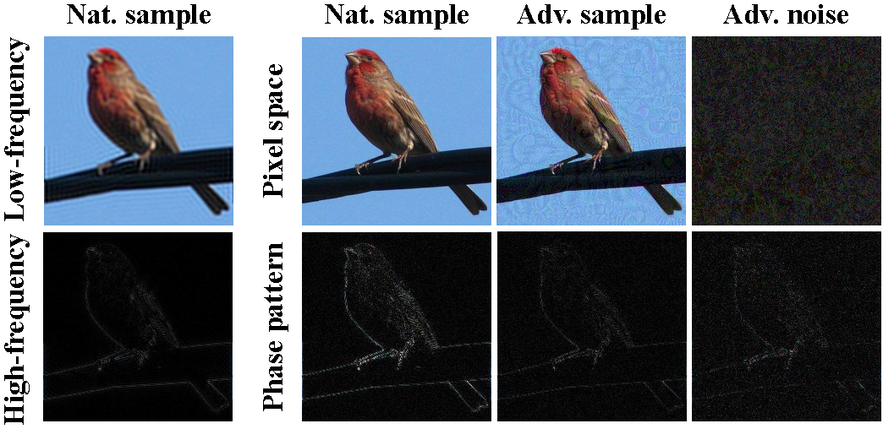
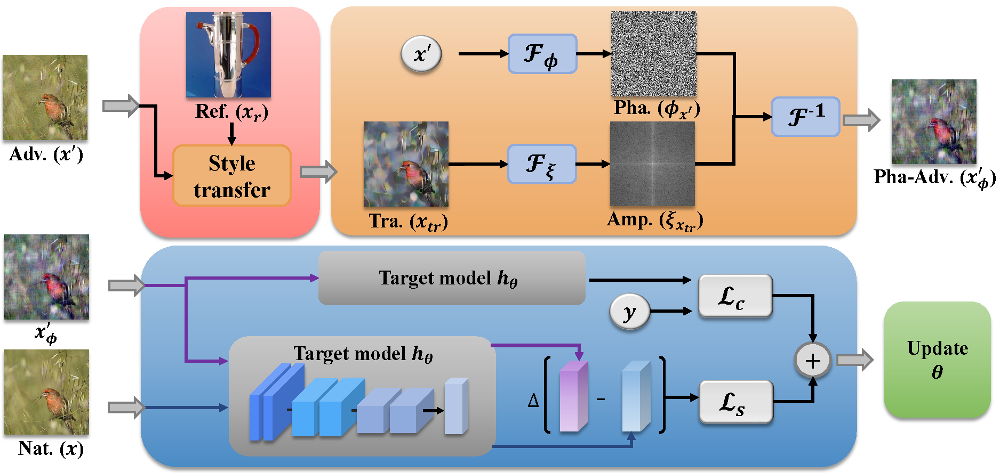

<div align="center">   
  
# Phase-aware Adversarial Defense for Improving Adversarial Robustness
[](https://proceedings.mlr.press/v202/zhou23m/zhou23m.pdf)

</div>

The implementation of [Phase-aware Adversarial Defense for Improving Adversarial Robustness](https://proceedings.mlr.press/v202/zhou23m/zhou23m.pdf) (ICML 2023).

Deep neural networks have been found to be vulnerable to adversarial noise. Recent works show that exploring the impact of adversarial noise on intrinsic components of data can help improve adversarial robustness. However, the pattern closely related to human perception has not been deeply studied. In this paper, inspired by the cognitive science, we investigate the interference of adversarial noise from the perspective of image phase, and find ordinarily-trained models lack enough robustness against phase-level perturbations. Motivated by this, we propose a joint adversarial defense method: a phase-level adversarial training mechanism to enhance the adversarial robustness on the phase pattern; an amplitude-based pre-processing operation to mitigate the adversarial perturbation in the amplitude pattern. Experimental results show that the proposed method can significantly improve the robust accuracy against multiple attacks and even adaptive attacks. In addition, ablation studies demonstrate the effectiveness of our defense strategy.


<p float="left" align="center">
 
<figcaption align="center">
The illustrations of the low-frequency component, highfrequency component and phase pattern. Nat. and Adv. samples denote natural and adversarial samples. The noise is crafted by PGD attack.
</figcaption>
</p>


<p float="left" align="center">
 
<figcaption align="center">
  
The training procedure of the Phase-aware Adversarial Defense (PAD). *Adv.*, *Nat.*, *Ref.*, *Tra.*, *Pha.*, *Amp.* and *Pha-Adv.* mean the adversarial sample, natural sample, reference sample, transitional reference sample, phase spectrum, amplitude spectrum and recombined phase-level adversarial sample, respectively. $\Delta$ denotes the distance metric. The pre-processing procedure of our method in the inference stage is similar to the pink and orange parts.
</figcaption>
</p>


## Requirements
- This codebase is written for `python3` and 'pytorch'.
- To install necessary python packages, run `pip install -r requirements.txt`.


## Experiments
### Data
- Please download and place the dataset into the 'data' directory.
- Please download and place the pre-trained style transfer model (vgg and decoder) into the './checkpoint/style' directory ([An example for the pre-trained style transfer model](https://drive.google.com/drive/folders/1s8yPdAtLkwxTePnWYTHvEN4OXauhg0HS?usp=drive_link)). 


### Training
To train the target model using PAD 

```
python train_PAD.py --model-dir 'your checkpoint directory'
```

To test the learned model

```
python test_PAD.py --model-dir 'your checkpoint directory'
```


## License and Contributing
- This README is formatted based on [paperswithcode](https://github.com/paperswithcode/releasing-research-code).
- Feel free to post issues via Github. 


## Reference
If you find the code useful in your research, please consider citing our paper:


<pre>
@InProceedings{pmlr-v202-zhou23m,
  title = 	 {Phase-aware Adversarial Defense for Improving Adversarial Robustness},
  author =       {Zhou, Dawei and Wang, Nannan and Yang, Heng and Gao, Xinbo and Liu, Tongliang},
  booktitle = 	 {Proceedings of the 40th International Conference on Machine Learning},
  pages = 	 {42724--42741},
  year = 	 {2023},
  publisher =    {PMLR}
}
</pre>
